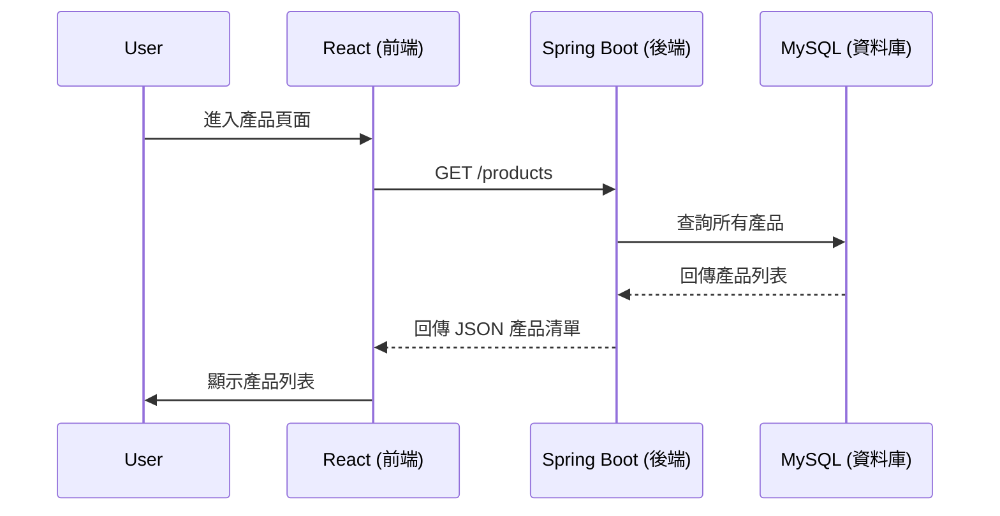
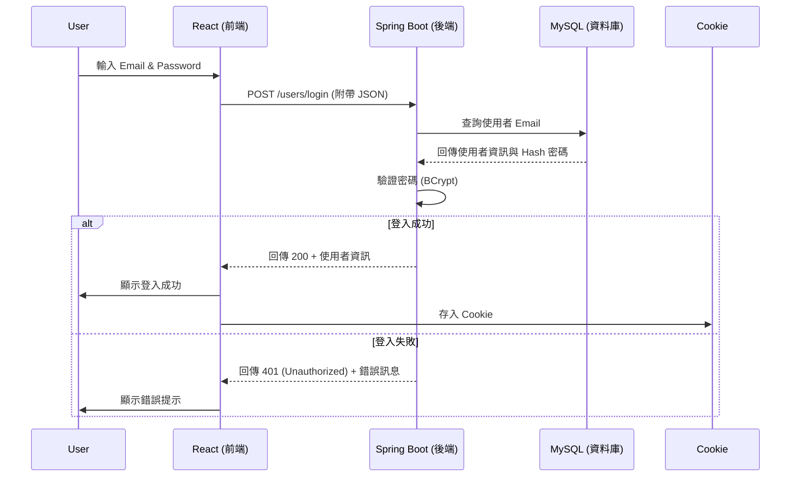
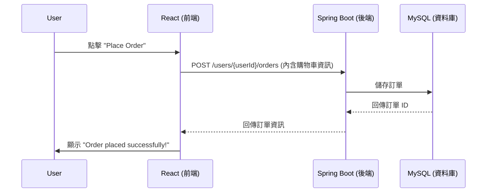
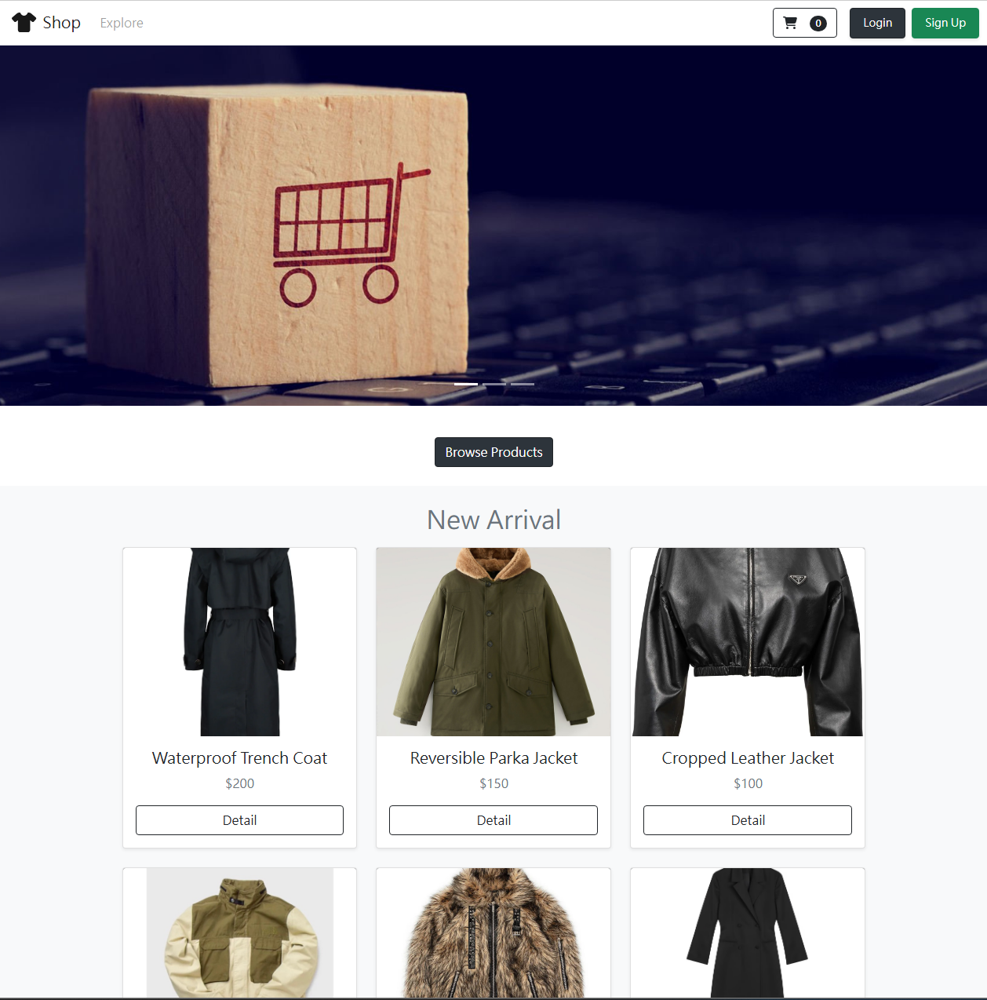
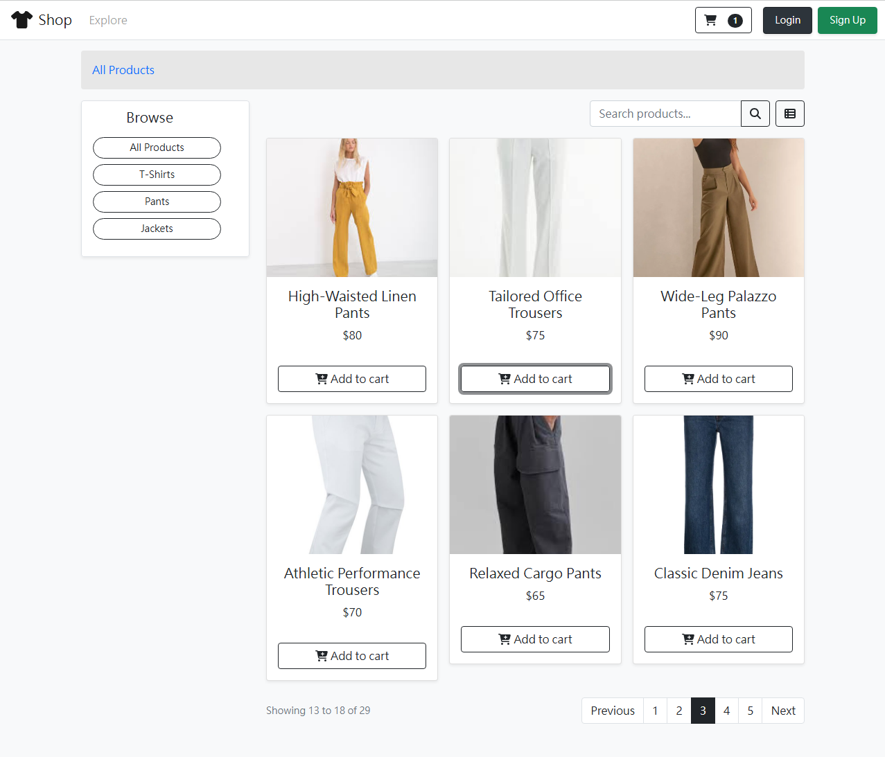
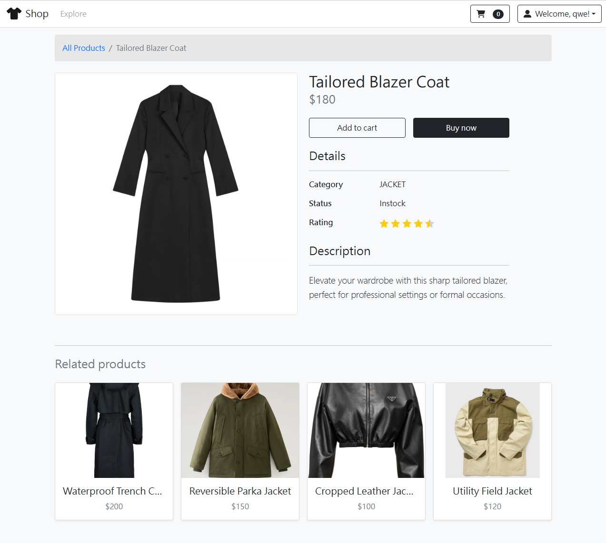
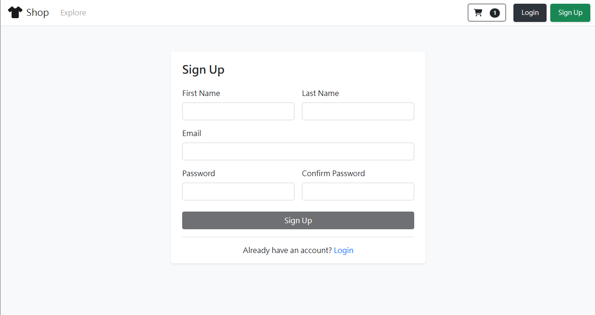
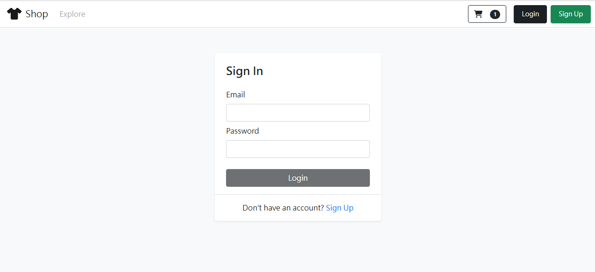
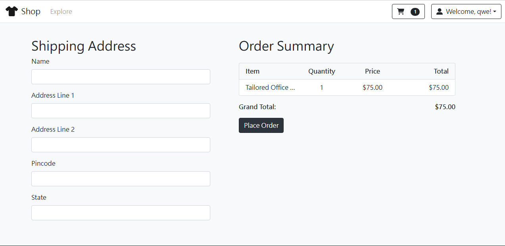
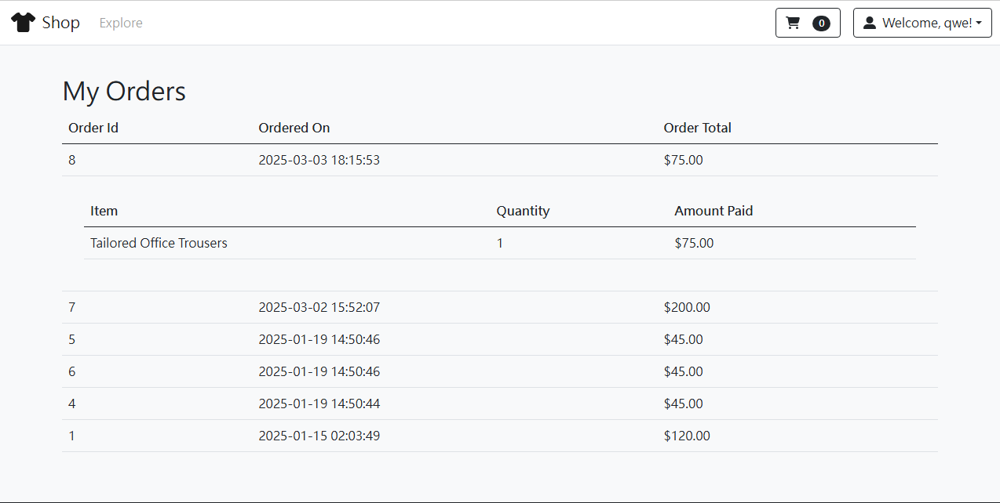

#  E-Commerce Project
---
這是一個使用 **React + Spring Boot** 開發的電商專案，包含會員註冊登入、商品瀏覽及訂單功能。

## 使用的技術
- **前端**: React 18
- **後端**: Spring Boot 3.3.4
- **資料庫**: MySQL
- **部署**: Netlify, Render, Aiven

## 專案目錄結構
```
fullstack-project
│── springboot-mall          # Spring Boot 後端
│   ├── springboot-mall/src/main/java/com/lalochen/springbootmall
|   |   ├── config
|   |   ├── constant
│   │   ├── controller
|   |   ├── dao
|   |   ├── dto
|   |   ├── model
|   |   ├── rowmapper
│   │   ├── service    
│   │   ├── util
|   |   ├── SpringbootMallApplication.java
│   ├── src/main/resources
│   │   ├── application.properties
│   ├── pom.xml          
│
│── react-ecommerce-project     # React 前端
│   ├── src
│   │   ├── auth
│   │   ├── context
│   │   ├── landing
│   │   ├── orders
│   │   ├── products
│   │   ├── services
│   │   ├── shopping-cart
│   │   ├── template
│   │   ├── App.css
│   │   ├── App.js
│   │   ├── bootstrap-custom.css
│   │   ├── bootstrap-custom.css.map
│   │   ├── bootstrap-custom.scss
│   │   ├── index.css
│   │   ├── index.js
│   │   ├── logo.svg
│   
│── package-lock.json
│── package.json 
│── README.md         
```
## 前後端溝通
🔹 **瀏覽產品 API（`GET /products`）**

1. 使用者進入產品頁面
    - 使用者開啟前端的「產品列表」頁面。
2.  前端發送 API 請求
    - React 應用程式向後端發送 GET /products 請求，請求所有產品資訊。
3. 後端查詢資料庫
    - Spring Boot 應用程式收到請求後，向 MySQL 資料庫查詢所有可用的產品。
4. 資料庫回傳產品列表
    - MySQL 資料庫將查詢結果（包含所有產品資訊）回傳給後端。
5. 後端回傳 JSON 資料
    - Spring Boot 將資料庫回傳的產品列表轉換為 JSON 格式，並回應給前端。
        ```
        {
            "limit": 50,
            "offset": 0,
            "total": 30,
            "results":[
            {"productId": 21, "productName": "Classic Denim Jacket", "category": "JACKET", "imageUrl": "https://encrypted-tbn0.gstatic.com/images?q=tbn:ANd9GcQ4A5wUjGZuOmQbMOpn0b3gd5QpCdsR8RQBQA&s",…},
            {"productId": 22, "productName": "Lightweight Windbreaker", "category": "JACKET", "imageUrl": "https://www.globalblank.com/cdn/shop/products/exp54lwzcBCMO_1_1_500x.jpg",…},
            {"productId": 23, "productName": "Oversized Hoodie Jacket", "category": "JACKET", "imageUrl": "https://jp.bape.com/cdn/shop/files/00CZPK202003_BEI_A_1040x.jpg?v=1714464412",…},
            {"productId": 24, "productName": "Quilted Puffer Jacket", "category": "JACKET", "imageUrl": "https://www.trueclassictees.com/cdn/shop/products/4605_BLACK_1_GRAY.jpg?v=1660945481&width=1000",…}
            ...]
        }
        ```
6. 前端顯示產品列表
    - React 應用程式接收 JSON 數據，解析後動態渲染 UI，顯示產品列表給使用者。

---
🔹 **用戶登入 API（`POST /users/login`）**

1. 前端發送 API 請求
    - 使用者在 登入畫面（/login）輸入 Email / Password
    - React 透過 fetch 向後端發送 POST /users/login
        ```
        {
            "email": "user@example.com",
            "password": "mypassword"
        } 
        ```
2. 後端接收請求並回應
    - Spring Boot 透過 UserController 處理請求
    - 先檢查 Email 是否存在
    - 若存在，從資料庫取得密碼，使用 BCrypt 進行比對
    - 驗證帳號密碼，若成功則回傳登入狀態及用戶資訊
        ```
        {
            "loggedIn": true,
            "user":{
                    "userId": 1,
                    "email": "qwe@qwe",
                    "createdDate": "2025-01-07 21:38:35",
                    "lastModifiedDate": "2025-01-07 21:38:35",
                    "firstName": "qwe",
                    "lastName": "qwe"
            }
        }
        ```
3. 前端儲存資訊在 Cookie
- React 會將登入狀態及用戶資訊存在 Cookie
- 之後重開頁面或下訂單即不需要重新登入


---
🔹 **下訂單 API（`POST /users/{userId}/orders`）**

1. 使用者點擊「Place Order」按鈕
    - 使用者在購物車頁面點擊「Place Order」按鈕
2. 前端發送 API 請求
    - React 應用程式向後端發送 POST /users/{userId}/orders 請求，並在請求的 Body 中附上購物車內的商品資訊。
        ```
        {
            "buyItemList": [
                {
                "productId": 9,
                "quantity": 1
                },
                {
                "productId": 10,
                "quantity": 2
                }
            ]
        }
        ```
3. 後端儲存訂單資訊
    - Spring Boot 應用程式接收請求，解析購物車內容，並將訂單資訊存入 MySQL 資料庫。
4. 資料庫回傳訂單 ID
    - MySQL 資料庫成功建立訂單後，回傳新建的訂單 ID。
5. 後端回傳訂單資訊
    - Spring Boot 應用程式將訂單 ID 和相關資訊封裝成 JSON，並回應給前端。
        ```
        {
            "orderId": 2,
            "userId": 1,
            "totalAmount": 120,
            "createdDate": "2025-03-03 16:04:48",
            "lastModifiedDate": "2025-03-03 16:04:48",
            "orderItemList":[
                {"orderItemId": 3, "orderId": 2, "productId": 9, "quantity": 1, "amount": 30,…},
                {"orderItemId": 4, "orderId": 2, "productId": 10, "quantity": 2, "amount": 90,…}
            ]
        }
        ```
6. 前端顯示訂單成功訊息
    - React 應用程式收到回應後，顯示「Order placed successfully!」的訊息，通知使用者訂單已建立成功。


## API 文件
完整 API 文件請參考 [Swagger UI](https://spring-boot-app-latest-wk2w.onrender.com/swagger-ui/index.html#/)

## 專案 Demo
[Live Demo](https://frolicking-biscochitos-2d9e1d.netlify.app/)
### 首頁

### 商品瀏覽

### 商品細節

### 註冊畫面

### 登入畫面

### 結帳畫面

### 用戶訂單畫面

